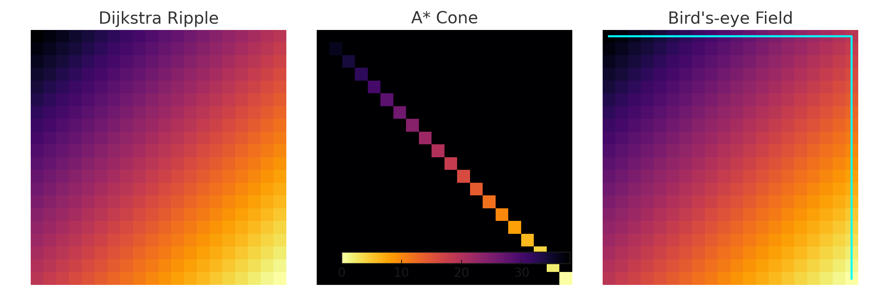

# Bird’s-eye Pathfinding

> **“See the maze from above.”**  
> A visualization-first pathfinding approach that treats shortest paths as a *downhill walk on a global distance field*.

---

## Live Demo
[CLICK HERE](https://arthugr.github.io/birdseye-pathfinder/demo.html)

## Table of Contents
- [Overview](#overview)
- [Key Idea](#key-idea)
- [When to Use](#when-to-use)
- [Included Methods](#included-methods)
- [Algorithms](#algorithms)
  - [Dijkstra (Start-rooted)](#dijkstra-start-rooted)
  - [Hybrid Frontier (Start-rooted)](#hybrid-frontier-start-rooted)
  - [Bird’s-eye (Goal-rooted Field)](#birdseye-goal-rooted-field)
- [Complexity](#complexity)
- [Comparison](#comparison)
- [Visualization](#visualization)
- [Demo Controls](#demo-controls)
- [FAQ](#faq)
- [License](#license)

---

## Overview
**Bird’s-eye Pathfinding** assumes the agent can “scan the map from above.”  
Instead of expanding outward from the start (like Dijkstra/A\*), we first compute a **distance field** from the goal (cost-to-go for *every* cell). The shortest path is then obtained by greedy **downhill descent** on this field.

This mirrors how humans solve visible mazes: you don’t simulate exploration; you “see the valley” that leads to the exit.

---

## Key Idea
1. **Compute distance field** `dist[y][x]` by running Dijkstra (or BFS if unweighted) **from the goal**.
2. **Extract the path** by repeatedly stepping from `start` to the neighbor with the **lowest** `dist`.

This produces an **optimal** path because the field encodes exact costs-to-go.

---

## When to Use
- You want a **global**, visual explanation of shortest paths.
- **Many agents** need to go to the **same goal** (build the field once, reuse for all).
- Teaching/visualization: heatmaps and downhill paths are intuitive.
- Dense graphs / mazes with **many equal-cost routes**.

> If you only need a single path once and memory is tight, A\* or Dijkstra may be simpler.

---

## Included Methods
This repo/demo includes three approaches so you can compare:

- **Dijkstra** (start-rooted, optimal, exhaustive ripple)
- **Hybrid Frontier** (start-rooted, optimal, expands sampled pivots)
- **Bird’s-eye** (goal-rooted distance field + downhill path, instant extraction)

---

## Algorithms

### Dijkstra (Start-rooted)
Expands nodes in exact distance order from the **start** using a priority queue (or set in the visual demo).  
Guarantees optimality on nonnegative weights but explores broadly.

### Hybrid Frontier (Start-rooted)
Like Dijkstra, but in each iteration it:
- Sorts or orders the frontier by tentative distance,
- Picks **pivots** (e.g., every *k*-th item),
- Relaxes from those, and **shrinks** the frontier.

Still optimal on nonnegative weights. It reduces pointless work when frontiers are huge and many nodes have similar distances.

### Bird’s-eye (Goal-rooted Field)
Compute **global cost-to-go** from the **goal** (Dijkstra/BFS). Then:
- From `start`, repeatedly move to the neighbor with **lower** `dist`.
- Stop at `goal`.

Pseudocode:
```text
function birdseye(grid, start, goal):
    dist = dijkstra_from_goal(grid, goal)   # distance field
    path = []
    cur = start
    while cur != goal:
        path.append(cur)
        cur = argmin_{n in neighbors(cur)} dist[n]
    path.append(goal)
    return path
````

---

## Complexity

Let `N` be the number of traversable nodes.

* **Dijkstra**: `O(N log N)` with a good PQ; extraction is immediate after expansions.
* **Hybrid**: same big-O optimality; fewer relaxations/steps in practice on plateaus.
* **Bird’s-eye**:

  * Field build: `O(N log N)` (weighted) or `O(N)` (unweighted/BFS).
  * Path extraction: `O(path length)`.
  * **Multi-agent**: build once, descend many times ⇒ excellent amortized cost.

Memory: Bird’s-eye stores the full `dist` field (`O(N)`), which is also great for visualization.

---

## Comparison

| Method     | Strategy                           | Memory     | Path Optimal | Notes                                          |
| ---------- | ---------------------------------- | ---------- | ------------ | ---------------------------------------------- |
| Dijkstra   | Start-rooted, exact order          | High (PQ)  | ✅            | Broad exploration                              |
| Hybrid     | Start-rooted, sampled pivots       | Medium     | ✅            | Fewer relaxations on plateaus                  |
| Bird’s-eye | Goal-rooted global field + descent | O(N) field | ✅            | Instant path extraction; great for multi-agent |

---

## Visualization



**Interpretation**

* **Dijkstra Ripple**: full expansion field (everything gets a number).
* **A\* Cone**: expansion focused toward the goal (heuristic-guided).
* **Bird’s-eye Field**: same global field, with the **downhill shortest path** traced in cyan.

> You can also enable heatmaps directly in the demos to see the field over a real maze.

---

## Demo Controls

Common controls across demos:

* **Grid size (odd)** — maze resolution.
* **Braid %** — open some dead-ends to add loops (cycles).
* **Extra links %** — open random walls anywhere to increase connectivity.
* **Tie density %** — set many cells to equal weight (creates big equal-cost plateaus).
* **Weighted terrain** — random 1–9 movement costs (nonnegative).
* **Hybrid k** — sampling stride for hybrid pivots.
* **Playback speed** — visualization timing.
* **Compare** — run all methods on the same maze and show metrics.

**Tip:** To highlight Bird’s-eye and Hybrid benefits, increase **Braid**, **Links**, and **Tie density**. You’ll see many equal-cost routes and fewer relaxations required by Hybrid; Bird’s-eye remains a single global solve with O(path) extraction.

---

## FAQ

**Is Bird’s-eye a new shortest-path algorithm?**
Not in complexity-theoretic terms. It’s **goal-rooted Dijkstra/BFS** to build a **distance field**, then a trivial greedy descent to extract paths. The value is in **interpretation**, **visual clarity**, and **multi-agent efficiency**.

**Does it work with weights?**
Yes, as long as weights are **nonnegative**. Use Dijkstra (not BFS) to build the field.

**What about dynamic maps?**
If costs/walls change, you typically recompute the field. (Advanced: incremental/dynamic SSSP can update fields faster.)

**Can I combine it with A\*?**
Yes. You can build a partial field (or heuristic distance map) or run A\* with a domain-specific heuristic; Bird’s-eye gives you the *exact* heuristic after the fact.

---

## License

MIT © 2025 Arthur Grustins
